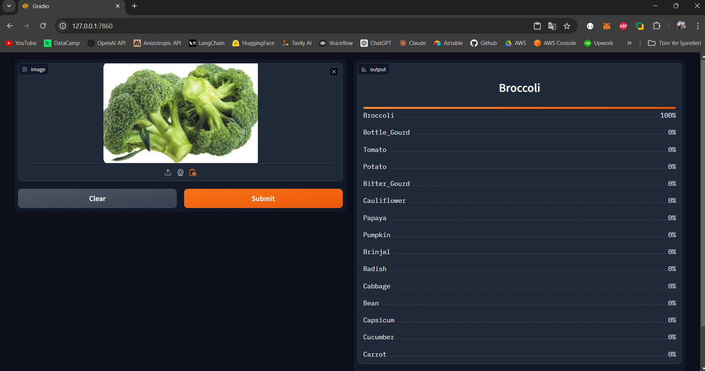

# Vegetable Classification Project

<div align="left">
  
</div>


## Introduction

Classification of 15 different types of vegetables was performed using transfer learning with the EfficientNet B0 model. The application was developed using Gradio, and PyTorch was utilized as the main library.

'Bean', 'Bitter_Gourd', 'Bottle_Gourd', 'Brinjal', 'Broccoli', 'Cabbage', 'Capsicum', 'Carrot', 'Cauliflower', 'Cucumber', 'Papaya', 'Potato', 'Pumpkin', 'Radish', 'Tomato'

---

### Installation 


```
git clone https://github.com/kntvrl/vegetable_classification_project.git

cd vegetable_classification_project
python -m venv venv
pip install -r requirements.txt
python gradio_infer.py

http://127.0.0.1:7860

```
